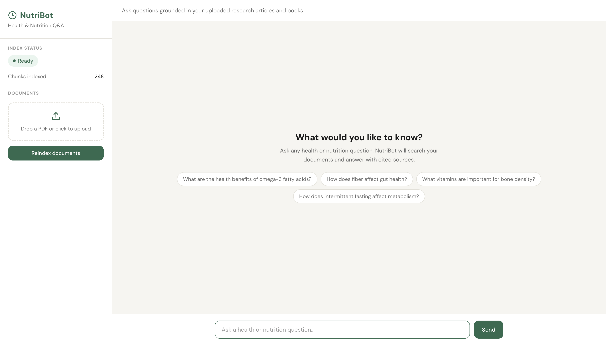
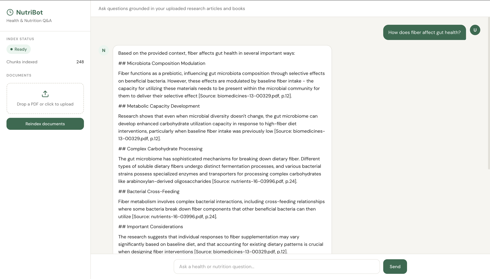
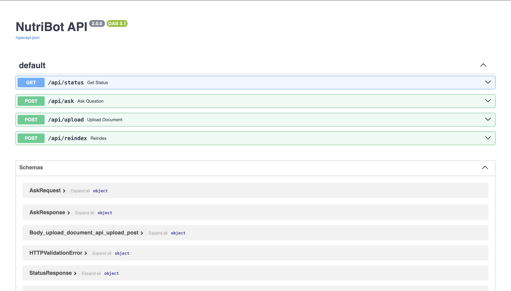

# NutriBot — Domain-Specific RAG Q&A System for Nutrition Research

A production-style RAG (Retrieval-Augmented Generation) chatbot that answers health and nutrition questions grounded in peer-reviewed research. Built with hybrid search, an evaluation pipeline, and multiple cost-optimization layers.

> **Resume one-liner:** Built a domain-specific RAG Q&A system for nutrition research using Claude Sonnet, hybrid search (FAISS + BM25), and a 30-question evaluation pipeline. Reduced API costs by ~50% through threshold gating and response caching.

---

## Demo

**Welcome screen** — shows index status, document upload, and example query chips:



**Live answer** — cited response with source document and page number:



Ask questions like:
- *"How does fiber affect the gut microbiome?"*
- *"What are the anti-inflammatory mechanisms of omega-3 fatty acids?"*
- *"How does the Mediterranean diet reduce cardiovascular risk?"*

Every answer is **cited** with source document and page number.

---

## Architecture

```
PDFs → PyMuPDF → Overlapping chunks → Sentence-Transformers → FAISS index
                                    ↘ BM25 index (keyword)

User question → Embed query → FAISS search ──┐
                            → BM25 search  ──┴→ RRF Fusion → Top-k chunks
                                                                    │
                                              Score threshold gate  │
                                              Answer cache check    │
                                                                    ↓
                                                            Claude Sonnet
                                                                    │
                                                                    ↓
                                                       Cited answer + sources
```

### Why Hybrid Search?

| Query Type | FAISS Only | BM25 Only | Hybrid |
|---|---|---|---|
| "How do omega-3s reduce inflammation?" | Strong | Weak | **Strong** |
| "What is SCFA?" | Weak | Strong | **Strong** |
| "Benefits of fish for heart health" | Strong | Moderate | **Strong** |
| "Lactobacillus effects on IBD" | Moderate | Strong | **Strong** |

FAISS handles semantic similarity; BM25 handles exact keyword matches. Reciprocal Rank Fusion (RRF) merges both ranked lists — documents appearing high in both bubble to the top.

---

## Tech Stack

| Layer | Technology | Cost |
|---|---|---|
| LLM | Claude Sonnet (`claude-sonnet-4-20250514`) | ~$0.006/query |
| Embeddings | `all-MiniLM-L6-v2` (sentence-transformers) | Free — local |
| Semantic Search | FAISS (`IndexFlatIP`, cosine similarity) | Free — local |
| Keyword Search | Custom Okapi BM25 (zero dependencies) | Free — local |
| Fusion | Reciprocal Rank Fusion (k=60) | Free — local |
| Backend | Python 3.10+ / FastAPI / Uvicorn | Free |
| Frontend | React 18 / Vite | Free |
| PDF Parsing | PyMuPDF (`fitz`) | Free |

---

## Cost Optimization

Only Claude Sonnet costs money. Four gates reduce API calls by ~50%:

1. **Answer cache** — MD5-hashed question lookup; repeated questions cost $0
2. **Score threshold** — if top chunk's semantic score < 0.3, return fallback without calling the API
3. **Chunk filtering** — drop low-relevance chunks (score < 0.2) before sending to Claude
4. **Token budget** — capped at 512 output tokens per answer

Estimated cost for regular use: **~$2–4/month**

---

## Knowledge Base

5 open-access peer-reviewed papers indexed across key nutrition domains:

| Paper | Domain |
|---|---|
| Relationships Between Human Gut Microbiome, Diet, and Obesity (Patloka et al., 2024) | Gut Health |
| Omega-3 Fatty Acids: Sources, Functions and Health Benefits (Patted et al., 2024) | Fatty Acids |
| The Mediterranean Diet, Its Microbiome Connections, and Cardiovascular Health (Abrignani et al., 2024) | Diet Patterns |
| The Interplay of Nutrition, the Gut Microbiota and Immunity (2025) | Immunity |
| Exploring the Gut Microbiome: Probiotics, Prebiotics, Synbiotics, and Postbiotics (2024) | Supplements |

---

## Evaluation

A 30-question evaluation suite (6 questions per paper) measures retrieval and answer quality.

| Metric | What it measures | Cost |
|---|---|---|
| Keyword Hit Rate | Fraction of expected keywords found in retrieved chunks | Free |
| Mean Reciprocal Rank (MRR) | How high the first relevant chunk ranks | Free |
| Answer Keyword Coverage | Fraction of expected keywords in Claude's final answer | ~$0.006/q |

```bash
# Free — run repeatedly while tuning
python -m app.evaluate --retrieval-only

# Full eval (~$0.18 total for 30 questions)
python -m app.evaluate
```

---

## Quick Start

### Prerequisites

- Python 3.10+
- Node.js 18+
- Anthropic API key

### 1. Backend

```bash
cd backend
python -m venv venv
source venv/bin/activate       # Windows: venv\Scripts\activate
pip install -r requirements.txt

export ANTHROPIC_API_KEY="sk-ant-..."

# Place PDFs in backend/data/documents/, then:
python -m app.ingest

uvicorn app.main:app --reload --port 8000
```

### 2. Frontend

```bash
cd frontend
npm install
npm run dev
# Opens at http://localhost:5173
```

### 3. Verify

```bash
curl http://localhost:8000/api/status
# {"ready": true, "num_chunks": 612, ...}

curl -X POST http://localhost:8000/api/ask \
  -H "Content-Type: application/json" \
  -d '{"question": "How does fiber affect gut health?"}'
```

---

## Project Structure

```
nutribot/
├── backend/
│   ├── app/
│   │   ├── config.py             # All settings: chunk size, top-k, thresholds, model
│   │   ├── ingest.py             # PDF → text → chunks → FAISS index + metadata JSON
│   │   ├── hybrid_retriever.py   # FAISS + BM25 + RRF hybrid retriever
│   │   ├── llm.py                # Claude Sonnet integration, RAG prompt
│   │   ├── evaluate.py           # 30-question eval suite, retrieval + answer metrics
│   │   └── main.py               # FastAPI app: endpoints, caching, threshold gating
│   └── data/
│       ├── documents/            # PDF papers (not committed)
│       └── faiss_index/          # Auto-generated index (not committed)
├── frontend/
│   └── src/
│       ├── components/           # ChatWindow, MessageBubble, SourceCard, UploadPanel
│       ├── hooks/useChat.js      # API hooks
│       └── styles/index.css
└── README.md
```

---

## Configuration

All tunable settings live in [backend/app/config.py](backend/app/config.py):

| Setting | Default | Effect |
|---|---|---|
| `CHUNK_SIZE` | 400 | Words per chunk — smaller = more precise retrieval |
| `CHUNK_OVERLAP` | 40 | Overlap between consecutive chunks |
| `TOP_K` | 3 | Chunks sent to Claude per query |
| `MIN_SCORE_THRESHOLD` | 0.3 | Below this score, skip the API call |
| `ENABLE_CACHE` | True | Cache answers by question hash |
| `CLAUDE_MAX_TOKENS` | 512 | Max output tokens per answer |

---

## API Reference

Interactive API docs available at `http://localhost:8000/docs`:



| Method | Endpoint | Description | Calls LLM? |
|---|---|---|---|
| `GET` | `/api/status` | Index status + cache size | No |
| `POST` | `/api/ask` | Ask a question | Yes (with gates) |
| `POST` | `/api/upload` | Upload a PDF | No |
| `POST` | `/api/reindex` | Rebuild FAISS + BM25 indices | No |

---

## What I Learned

- **Hybrid search beats pure semantic search** for domain-specific corpora. BM25 excels on exact terminology (e.g., "SCFA", "Lactobacillus") that embeddings may conflate with semantically similar but incorrect terms.
- **RRF is remarkably robust** — the k=60 smoothing constant means you don't need to normalize scores across retrievers, making fusion simple and effective.
- **Cost gates compound well** — caching, threshold filtering, and chunk pruning each save a small fraction, but together cut API usage roughly in half without measurably degrading answer quality.
- **Evaluation before tuning matters** — running retrieval-only eval (free) let me tune chunk size and TOP_K before spending anything on generation.

---

## License

MIT
